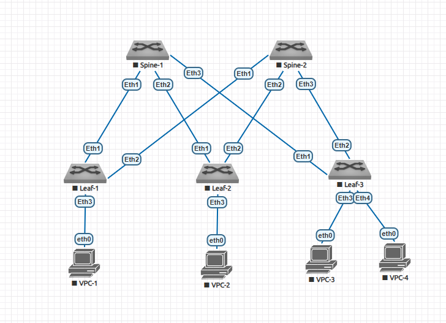

### Underlay. OSPF

### Цель

- Настроить OSPF для Underlay сети

## Задачи

- Настроить OSPF в Underlay сети, для IP связанности между всеми сетевыми устройствами.
- Зафиксировать адресное пространство, схему сети, конфигурацию устройств
- Убедиться в наличии IP связанности между устройствами в OSFP домене

### 1. Подготовка стенда

Схема из адресный план из ДЗ№1:



### 2. Настройка устройств

На каждом устройстве произведена настройка адресации согласно плана:

```
Spine-1#
Spine-1#conf t
Spine-1(config)#interface Ethernet1
Spine-1(config-if-Et1)#   no switchport
Spine-1(config-if-Et1)#   ip address 10.2.1.0/31
Spine-1(config-if-Et1)#interface Ethernet2
Spine-1(config-if-Et2)#   no switchport
Spine-1(config-if-Et2)#   ip address 10.2.1.2/31
Spine-1(config-if-Et2)#interface Ethernet3
Spine-1(config-if-Et3)#   no switchport
Spine-1(config-if-Et3)#   ip address 10.2.1.4/31
Spine-1(config-if-Et3)#interface Loopback1
Spine-1(config-if-Lo1)#   ip address 10.0.1.0/32
Spine-1(config-if-Lo1)#interface Loopback2
Spine-1(config-if-Lo2)#   ip address 10.1.1.0/32
```

Включен роутинг и настроен OSPF


### 2.2 Распределение DC1
```
DC1: 10.0.0.0/13
Lo1: 10.0.0.0/16
Lo2: 10.1.0.0/16
Суммарный для Lo1 и Lo2: 10.0.0.0/15

p2p links: 10.2.0.0/16
Резерв: 10.3.0.0/16
Суммарный для p2p и резерва: 10.2.0.0/15

Services:

Service1 - 10.4.0.0/16
Service2 - 10.5.0.0/16
Service3 - 10.6.0.0/16
Service4 - 10.7.0.0/16
Суммарный – 10.4.0.0/14
```

### 2.3 Таблица адресов

|Device|Interface|IP Address|Description|
|---|---|---|---|
Spine1|Lo1|10.0.1.0/32|
-|Lo2|10.1.1.0/32|
-|Eth1|10.2.1.0/31|Link to Leaf1|
-|Eth2|10.2.1.2/31|Link to Leaf2|
-|Eth3|10.2.1.4/31|Link to Leaf3|
Spine2|Lo1|10.0.2.0/32|
-|Lo2|10.1.2.0/32|
-|Eth1|10.2.2.0/31|Link to Leaf1|
-|Eth2|10.2.2.2/31|Link to Leaf2|
-|Eth3|10.2.2.4/31|Link to Leaf3|
Leaf1|Lo1|10.0.0.1/32|
-|Lo2|10.1.0.1/32|
-|Eth1|10.2.1.1/31|Link to Spine1|
-|Eth2|10.2.2.1/31|Link to Spine2|
-|Eth3|10.4.0.1/16|Service1|
Leaf2|Lo1|10.0.0.2/32|
-|Lo2|10.1.0.2/32|
-|Eth1|10.2.1.3/31|Link to Spine1|
-|Eth2|10.2.2.3/31|Link to Spine2|
-|Eth3|10.5.0.2/16|Service2|
Leaf3|Lo1|10.0.0.3/32|
-|Lo2|10.1.0.3/32|
-|Eth1|10.2.1.5/31|Link to Spine1|
-|Eth2|10.2.2.5/31|Link to Spine2|
-|Eth3|10.6.0.3/16|Service3|
-|Eth4|10.7.0.3/16|Service4|
