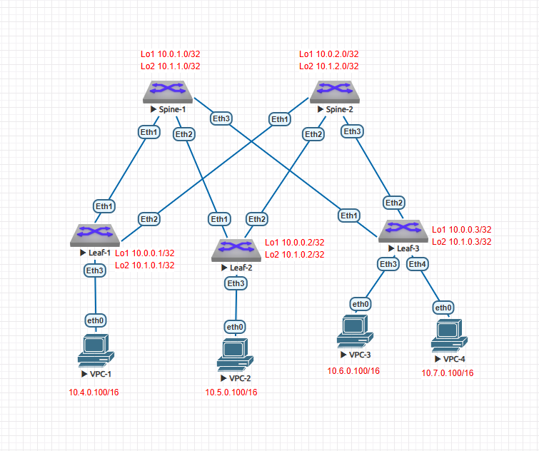

### Underlay. eBGP


### Цель

- Настроить eBGP в Underlay сети для IP связанности между всеми сетевыми устройствами.

## Задачи

- Настроить eBGP на устройствах стенда.
- Отобразить адресное пространство, схему сети, конфигурацию устройств.
- Убедиться в наличии IP связанности между устройствами Leaf.


### 1. Настройка устройств

Схема стенда из ДЗ №1:



На каждом устройстве произведена настройка адресации согласно плана из ДЗ №1: 

|Device|Interface|IP Address|Description|
|---|---|---|---|
Spine1|Lo1|10.0.1.0/32|
-|Lo2|10.1.1.0/32|
-|Eth1|10.2.1.0/31|Link to Leaf1|
-|Eth2|10.2.1.2/31|Link to Leaf2|
-|Eth3|10.2.1.4/31|Link to Leaf3|
Spine2|Lo1|10.0.2.0/32|
-|Lo2|10.1.2.0/32|
-|Eth1|10.2.2.0/31|Link to Leaf1|
-|Eth2|10.2.2.2/31|Link to Leaf2|
-|Eth3|10.2.2.4/31|Link to Leaf3|
Leaf1|Lo1|10.0.0.1/32|
-|Lo2|10.1.0.1/32|
-|Eth1|10.2.1.1/31|Link to Spine1|
-|Eth2|10.2.2.1/31|Link to Spine2|
-|Eth3|10.4.0.1/16|Service1|
Leaf2|Lo1|10.0.0.2/32|
-|Lo2|10.1.0.2/32|
-|Eth1|10.2.1.3/31|Link to Spine1|
-|Eth2|10.2.2.3/31|Link to Spine2|
-|Eth3|10.5.0.2/16|Service2|
Leaf3|Lo1|10.0.0.3/32|
-|Lo2|10.1.0.3/32|
-|Eth1|10.2.1.5/31|Link to Spine1|
-|Eth2|10.2.2.5/31|Link to Spine2|
-|Eth3|10.6.0.3/16|Service3|
-|Eth4|10.7.0.3/16|Service4|

eBGP наcтроен на всех устройствах.

• На спайнах настроен единый AS, на лифах - разные
• Настроен multipath для ECMP
• На интерфейсах настроен BFD


Пример настройки Spine1:

```
Spine2(config)#router isis DC1
Spine2(config-router-isis)#net 49.0001.0100.0000.2000.00
Spine2(config-router-isis)#is-type level-1
Spine2(config-router-isis)#address-family ipv4 unicast
Spine2(config-router-isis-af)#exit
Spine2(config-router-isis)#exit
Spine2(config)#interface eth1-3
Spine2(config-if-Et1-3)#isis enable DC1
Spine2(config-if-Et1-3)#exit
Spine2(config)#interface loopback 1-2
Spine2(config-if-Lo1-2)#isis enable DC1
Spine2(config-if-Lo1-2)#end
Spine2#write
Copy completed successfully.

```


### 2.2 Конфигурации устройств

Spine1

```
Spine-1#sh ru
! Command: show running-config
! device: Spine-1 (vEOS-lab, EOS-4.29.2F)
!
! boot system flash:/vEOS-lab.swi
!
no aaa root
!
transceiver qsfp default-mode 4x10G
!
service routing protocols model ribd
!
hostname Spine-1
!
spanning-tree mode mstp
!
interface Ethernet1
   no switchport
   ip address 10.2.1.0/31
   isis enable DC1
!
interface Ethernet2
   no switchport
   ip address 10.2.1.2/31
   isis enable DC1
!
interface Ethernet3
   no switchport
   ip address 10.2.1.4/31
   isis enable DC1
!
interface Ethernet4
!
interface Ethernet5
!
interface Ethernet6
!
interface Ethernet7
!
interface Ethernet8
!
interface Loopback0
!
interface Loopback1
   ip address 10.0.1.0/32
   isis enable DC1
!
interface Loopback2
   ip address 10.1.1.0/32
   isis enable DC1
!
interface Management1
!
ip routing
!
router isis DC1
   net 49.0001.0100.0000.1000.00
   is-type level-1
   !
   address-family ipv4 unicast
!
end

```
Spine2

```
! Command: show running-config
! device: Spine2 (vEOS-lab, EOS-4.29.2F)
!
! boot system flash:/vEOS-lab.swi
!
no aaa root
!
transceiver qsfp default-mode 4x10G
!
service routing protocols model ribd
!
hostname Spine2
!
spanning-tree mode mstp
!
interface Ethernet1
   no switchport
   ip address 10.2.2.0/31
   isis enable DC1
!
interface Ethernet2
   no switchport
   ip address 10.2.2.2/31
   isis enable DC1
!
interface Ethernet3
   no switchport
   ip address 10.2.2.4/31
   isis enable DC1
!
interface Ethernet4
!
interface Ethernet5
!
interface Ethernet6
!
interface Ethernet7
!
interface Ethernet8
!
interface Loopback1
   ip address 10.0.2.0/32
   isis enable DC1
!
interface Loopback2
   ip address 10.1.2.0/32
   isis enable DC1
!
interface Management1
!
ip routing
!
router isis DC1
   net 49.0001.0100.0000.2000.00
   is-type level-1
   !
   address-family ipv4 unicast
!
end

```
Leaf1

```
! Command: show running-config
! device: Leaf-1 (vEOS-lab, EOS-4.29.2F)
!
! boot system flash:/vEOS-lab.swi
!
no aaa root
!
switchport default mode routed
!
transceiver qsfp default-mode 4x10G
!
service routing protocols model ribd
!
!
!
match-list input string ztpFilter
   10 match regex ETH-4
!
hostname Leaf-1
!
spanning-tree mode mstp
!
interface Ethernet1
   no switchport
   ip address 10.2.1.1/31
   ipv6 enable
   ipv6 address auto-config
   ipv6 nd ra rx accept default-route
   isis enable DC1
!
interface Ethernet2
   speed 100g-2
   no switchport
   ip address 10.2.2.1/31
   ipv6 enable
   ipv6 address auto-config
   ipv6 nd ra rx accept default-route
   isis enable DC1
!
interface Ethernet3
   speed 100g-2
   no switchport
   ip address 10.4.0.1/16
   ipv6 enable
   ipv6 address auto-config
   ipv6 nd ra rx accept default-route
   isis enable DC1
!
interface Ethernet4
   speed 100g-2
   no switchport
   ipv6 enable
   ipv6 address auto-config
   ipv6 nd ra rx accept default-route
!
interface Ethernet5
   speed 100g-2
   no switchport
   ipv6 enable
   ipv6 address auto-config
   ipv6 nd ra rx accept default-route
!
interface Ethernet6
   speed 100g-2
   no switchport
   ipv6 enable
   ipv6 address auto-config
   ipv6 nd ra rx accept default-route
!
interface Ethernet7
   speed 100g-2
   no switchport
   ipv6 enable
   ipv6 address auto-config
   ipv6 nd ra rx accept default-route
!
interface Ethernet8
   speed 100g-2
   no switchport
   ipv6 enable
   ipv6 address auto-config
   ipv6 nd ra rx accept default-route
!
interface Loopback1
   ip address 10.0.3.0/32
   isis enable DC1
!
interface Loopback2
   ip address 10.1.3.0/32
   isis enable DC1
!
interface Management1
   speed 10full
   ipv6 enable
   ipv6 address auto-config
   ipv6 nd ra rx accept default-route
!
ip routing
!
system control-plane
   no service-policy input copp-system-policy
!
router isis DC1
   net 49.0001.0100.0000.0001.00
   is-type level-1
   !
   address-family ipv4 unicast
!
end

```

Leaf2

```
! Command: show running-config
! device: Leaf-2 (vEOS-lab, EOS-4.29.2F)
!
! boot system flash:/vEOS-lab.swi
!
no aaa root
!
switchport default mode routed
!
transceiver qsfp default-mode 4x10G
!
service routing protocols model ribd
!
!
!
match-list input string ztpFilter
   10 match regex ETH-4
!
hostname Leaf-2
!
spanning-tree mode mstp
!
interface Ethernet1
   no switchport
   ip address 10.2.1.3/31
   ipv6 enable
   ipv6 address auto-config
   ipv6 nd ra rx accept default-route
   isis enable DC1
!
interface Ethernet2
   no switchport
   ip address 10.2.2.3/31
   ipv6 enable
   ipv6 address auto-config
   ipv6 nd ra rx accept default-route
   isis enable DC1
!
interface Ethernet3
   speed 200g-4
   no switchport
   ip address 10.5.0.2/16
   ipv6 enable
   ipv6 address auto-config
   ipv6 nd ra rx accept default-route
   isis enable DC1
!
interface Ethernet4
   speed 200g-4
   no switchport
   ipv6 enable
   ipv6 address auto-config
   ipv6 nd ra rx accept default-route
!
interface Ethernet5
   speed 200g-4
   no switchport
   ipv6 enable
   ipv6 address auto-config
   ipv6 nd ra rx accept default-route
!
interface Ethernet6
   speed 200g-4
   no switchport
   ipv6 enable
   ipv6 address auto-config
   ipv6 nd ra rx accept default-route
!
interface Ethernet7
   speed 200g-4
   no switchport
   ipv6 enable
   ipv6 address auto-config
   ipv6 nd ra rx accept default-route
!
interface Ethernet8
   speed 200g-4
   no switchport
   ipv6 enable
   ipv6 address auto-config
   ipv6 nd ra rx accept default-route
!
interface Loopback1
   ip address 10.0.0.2/32
   isis enable DC1
!
interface Loopback2
   ip address 10.1.0.2/32
   isis enable DC1
!
interface Management1
   speed 100full
   ipv6 enable
   ipv6 address auto-config
   ipv6 nd ra rx accept default-route
!
ip routing
!
system control-plane
   no service-policy input copp-system-policy
!
router isis DC1
   net 49.0001.0100.0000.0002.00
   is-type level-1
   !
   address-family ipv4 unicast
!
end

```

Leaf3

```
! Command: show running-config
! device: Leaf-3 (vEOS-lab, EOS-4.29.2F)
!
! boot system flash:/vEOS-lab.swi
!
no aaa root
!
switchport default mode routed
!
transceiver qsfp default-mode 4x10G
!
service routing protocols model ribd
!
!
!
match-list input string ztpFilter
   10 match regex ETH-4
!
hostname Leaf-3
!
spanning-tree mode mstp
!
interface Ethernet1
   no switchport
   ip address 10.2.1.5/31
   ipv6 enable
   ipv6 address auto-config
   ipv6 nd ra rx accept default-route
   isis enable DC1
!
interface Ethernet2
   no switchport
   ip address 10.2.2.5/31
   ipv6 enable
   ipv6 address auto-config
   ipv6 nd ra rx accept default-route
   isis enable DC1
!
interface Ethernet3
   speed 100g-2
   no switchport
   ip address 10.6.0.3/16
   ipv6 enable
   ipv6 address auto-config
   ipv6 nd ra rx accept default-route
   isis enable DC1
!
interface Ethernet4
   speed 100g-2
   no switchport
   ip address 10.7.0.3/16
   ipv6 enable
   ipv6 address auto-config
   ipv6 nd ra rx accept default-route
   isis enable DC1
!
interface Ethernet5
   speed 100g-2
   no switchport
   ipv6 enable
   ipv6 address auto-config
   ipv6 nd ra rx accept default-route
!
interface Ethernet6
   speed 100g-2
   no switchport
   ipv6 enable
   ipv6 address auto-config
   ipv6 nd ra rx accept default-route
!
interface Ethernet7
   speed 100g-2
   no switchport
   ipv6 enable
   ipv6 address auto-config
   ipv6 nd ra rx accept default-route
!
interface Ethernet8
   speed 100g-2
   no switchport
   ipv6 enable
   ipv6 address auto-config
   ipv6 nd ra rx accept default-route
!
interface Loopback1
   ip address 10.0.0.3/32
   isis enable DC1
!
interface Loopback2
   ip address 10.1.0.3/32
   isis enable DC1
!
interface Management1
   speed 10full
   ipv6 enable
   ipv6 address auto-config
   ipv6 nd ra rx accept default-route
!
ip routing
!
system control-plane
   no service-policy input copp-system-policy
!
router isis DC1
   net 49.0001.0100.0000.0003.00
   is-type level-1
   !
   address-family ipv4 unicast
!
end

```

### 3. Проверка связности

Маршруты на Leaf1

```
Leaf-1#sh ip route isis

 I L1     10.0.0.2/32 [115/30] via 10.2.1.0, Ethernet1
                               via 10.2.2.0, Ethernet2
 I L1     10.0.0.3/32 [115/30] via 10.2.1.0, Ethernet1
                               via 10.2.2.0, Ethernet2
 I L1     10.0.1.0/32 [115/20] via 10.2.1.0, Ethernet1
 I L1     10.0.2.0/32 [115/20] via 10.2.2.0, Ethernet2
 I L1     10.1.0.2/32 [115/30] via 10.2.1.0, Ethernet1
                               via 10.2.2.0, Ethernet2
 I L1     10.1.0.3/32 [115/30] via 10.2.1.0, Ethernet1
                               via 10.2.2.0, Ethernet2
 I L1     10.1.1.0/32 [115/20] via 10.2.1.0, Ethernet1
 I L1     10.1.2.0/32 [115/20] via 10.2.2.0, Ethernet2
 I L1     10.2.1.2/31 [115/20] via 10.2.1.0, Ethernet1
 I L1     10.2.1.4/31 [115/20] via 10.2.1.0, Ethernet1
 I L1     10.2.2.2/31 [115/20] via 10.2.2.0, Ethernet2
 I L1     10.2.2.4/31 [115/20] via 10.2.2.0, Ethernet2
 I L1     10.5.0.0/16 [115/30] via 10.2.1.0, Ethernet1
                               via 10.2.2.0, Ethernet2
 I L1     10.6.0.0/16 [115/30] via 10.2.1.0, Ethernet1
                               via 10.2.2.0, Ethernet2
 I L1     10.7.0.0/16 [115/30] via 10.2.1.0, Ethernet1
                               via 10.2.2.0, Ethernet2


```

Маршруты на Leaf2

```
Leaf-2#sh ip route isis

 I L1     10.0.0.3/32 [115/30] via 10.2.1.2, Ethernet1
                               via 10.2.2.2, Ethernet2
 I L1     10.0.1.0/32 [115/20] via 10.2.1.2, Ethernet1
 I L1     10.0.2.0/32 [115/20] via 10.2.2.2, Ethernet2
 I L1     10.0.3.0/32 [115/30] via 10.2.1.2, Ethernet1
                               via 10.2.2.2, Ethernet2
 I L1     10.1.0.3/32 [115/30] via 10.2.1.2, Ethernet1
                               via 10.2.2.2, Ethernet2
 I L1     10.1.1.0/32 [115/20] via 10.2.1.2, Ethernet1
 I L1     10.1.2.0/32 [115/20] via 10.2.2.2, Ethernet2
 I L1     10.1.3.0/32 [115/30] via 10.2.1.2, Ethernet1
                               via 10.2.2.2, Ethernet2
 I L1     10.2.1.0/31 [115/20] via 10.2.1.2, Ethernet1
 I L1     10.2.1.4/31 [115/20] via 10.2.1.2, Ethernet1
 I L1     10.2.2.0/31 [115/20] via 10.2.2.2, Ethernet2
 I L1     10.2.2.4/31 [115/20] via 10.2.2.2, Ethernet2
 I L1     10.4.0.0/16 [115/30] via 10.2.1.2, Ethernet1
                               via 10.2.2.2, Ethernet2
 I L1     10.6.0.0/16 [115/30] via 10.2.1.2, Ethernet1
                               via 10.2.2.2, Ethernet2
 I L1     10.7.0.0/16 [115/30] via 10.2.1.2, Ethernet1
                               via 10.2.2.2, Ethernet2


```

Маршруты на Leaf3

```
Leaf-3#sh ip ro isis


 I L1     10.0.0.2/32 [115/30] via 10.2.1.4, Ethernet1
                               via 10.2.2.4, Ethernet2
 I L1     10.0.1.0/32 [115/20] via 10.2.1.4, Ethernet1
 I L1     10.0.2.0/32 [115/20] via 10.2.2.4, Ethernet2
 I L1     10.0.3.0/32 [115/30] via 10.2.1.4, Ethernet1
                               via 10.2.2.4, Ethernet2
 I L1     10.1.0.2/32 [115/30] via 10.2.1.4, Ethernet1
                               via 10.2.2.4, Ethernet2
 I L1     10.1.1.0/32 [115/20] via 10.2.1.4, Ethernet1
 I L1     10.1.2.0/32 [115/20] via 10.2.2.4, Ethernet2
 I L1     10.1.3.0/32 [115/30] via 10.2.1.4, Ethernet1
                               via 10.2.2.4, Ethernet2
 I L1     10.2.1.0/31 [115/20] via 10.2.1.4, Ethernet1
 I L1     10.2.1.2/31 [115/20] via 10.2.1.4, Ethernet1
 I L1     10.2.2.0/31 [115/20] via 10.2.2.4, Ethernet2
 I L1     10.2.2.2/31 [115/20] via 10.2.2.4, Ethernet2
 I L1     10.4.0.0/16 [115/30] via 10.2.1.4, Ethernet1
                               via 10.2.2.4, Ethernet2
 I L1     10.5.0.0/16 [115/30] via 10.2.1.4, Ethernet1
                               via 10.2.2.4, Ethernet2

```
Ping VPC2, VPC3, VPC4 с машины VPC1:

```
VPCS> ping 10.5.0.100

84 bytes from 10.5.0.100 icmp_seq=1 ttl=61 time=106.447 ms
84 bytes from 10.5.0.100 icmp_seq=2 ttl=61 time=31.555 ms
84 bytes from 10.5.0.100 icmp_seq=3 ttl=61 time=35.474 ms
84 bytes from 10.5.0.100 icmp_seq=4 ttl=61 time=31.781 ms
84 bytes from 10.5.0.100 icmp_seq=5 ttl=61 time=96.806 ms

VPCS> ping 10.6.0.100

84 bytes from 10.6.0.100 icmp_seq=1 ttl=61 time=82.501 ms
84 bytes from 10.6.0.100 icmp_seq=2 ttl=61 time=44.211 ms
84 bytes from 10.6.0.100 icmp_seq=3 ttl=61 time=50.197 ms
84 bytes from 10.6.0.100 icmp_seq=4 ttl=61 time=27.734 ms
84 bytes from 10.6.0.100 icmp_seq=5 ttl=61 time=31.171 ms

VPCS> ping 10.7.0.100

84 bytes from 10.7.0.100 icmp_seq=1 ttl=61 time=48.251 ms
84 bytes from 10.7.0.100 icmp_seq=2 ttl=61 time=36.471 ms
84 bytes from 10.7.0.100 icmp_seq=3 ttl=61 time=44.042 ms
84 bytes from 10.7.0.100 icmp_seq=4 ttl=61 time=75.808 ms
84 bytes from 10.7.0.100 icmp_seq=5 ttl=61 time=100.756 ms

```