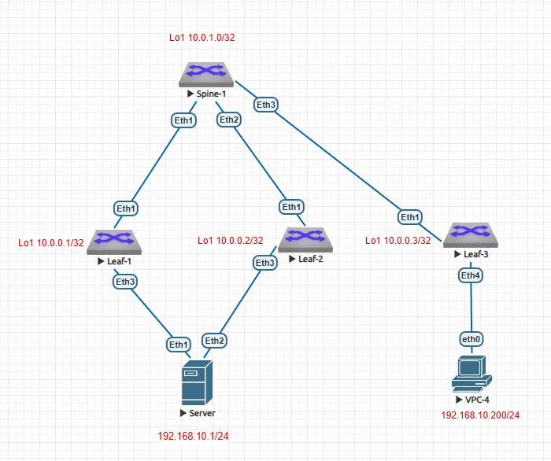
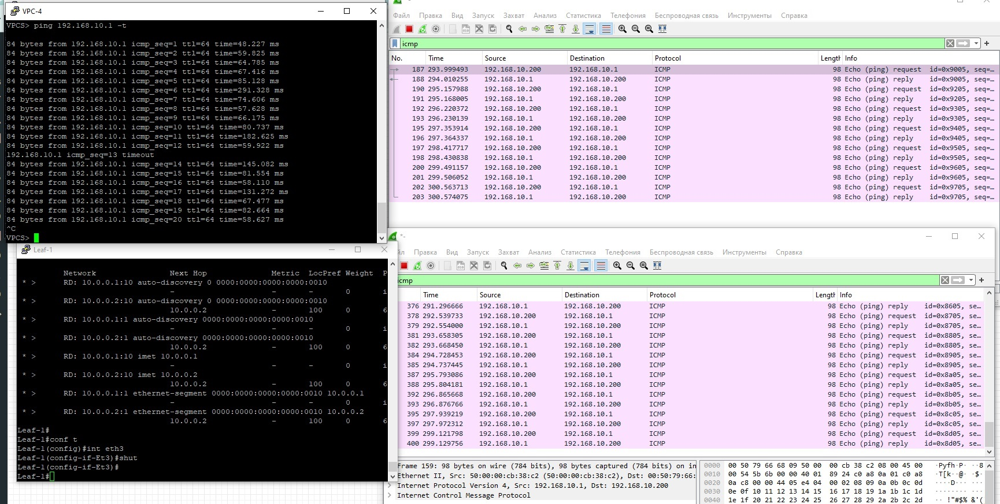

### VXLAN. Multihoming.


### Цель

- Настроить отказоустойчивое подключение клиентов с использованием EVPN Multihoming

## Задачи

- Подключите клиентов 2-я линками к различным Leaf
- Настроите агрегированный канал со стороны клиента
- Настроите multihoming для работы в Overlay сети. 
- Зафиксируете в документации - план работы, адресное пространство, схему сети, конфигурацию устройств
- Опционально - протестировать отказоустойчивость - убедиться, что связнность не теряется при отключении одного из линков


### 1. Предварительные условия

Схема стенда:



В качестве устройств Leaf, Spine и Server - коммутаторы Arista. 

Адресация:


|Device|Interface|IP Address|Description|
|---|---|---|---|
Spine1|Lo1|10.0.1.0/32|
-|Lo2|10.1.1.0/32|
-|Eth1|10.2.1.0/31|Link to Leaf1|
-|Eth2|10.2.1.2/31|Link to Leaf2|
-|Eth3|10.2.1.4/31|Link to Leaf3|
Leaf1|Lo1|10.0.0.1/32|
-|Lo2|10.1.0.1/32|
-|Eth1|10.2.1.1/31|Link to Spine1|
-|Eth3|10.4.0.1/16|Link to Server|
Leaf2|Lo1|10.0.0.2/32|
-|Lo2|10.1.0.2/32|
-|Eth1|10.2.1.3/31|Link to Spine1|
-|Eth3|10.5.0.2/16|Link to Server|
Leaf3|Lo1|10.0.0.3/32|
-|Lo2|10.1.0.3/32|
-|Eth1|10.2.1.5/31|Link to Spine1|
-|Eth4|-|VPC3|


### 2.1 Настройка Underlay OSPF

На всех устройствах настроен OSPF по аналогии с Lab2:

```
Spine-1

interface Ethernet1
   no switchport
   ip address 10.2.1.0/31
   bfd static neighbor 10.2.1.1
   ip ospf network point-to-point
   ip ospf area 0.0.0.0
!
interface Ethernet2
   no switchport
   ip address 10.2.1.2/31
   ip ospf network point-to-point
   ip ospf area 0.0.0.0
!
interface Ethernet3
   no switchport
   ip address 10.2.1.4/31
   ip ospf network point-to-point
   ip ospf area 0.0.0.0
!
...
!
interface Loopback1
   ip address 10.0.1.0/32
   ip ospf area 0.0.0.0
!
interface Loopback2
   ip address 10.1.1.0/32
   ip ospf area 0.0.0.0

!
router ospf 100
   passive-interface default
   no passive-interface Ethernet1
   no passive-interface Ethernet2
   no passive-interface Ethernet3
   max-lsa 12000


```
Остальные устройства настроены анаогично, везде настроена OSPF area 0.

### 2.2 Настройка eBGP и EVPN на Spine1 

Spine1

```
router bgp 65100
   neighbor 10.0.0.1 remote-as 65001
   neighbor 10.0.0.1 update-source Loopback1
   neighbor 10.0.0.1 ebgp-multihop 5
   neighbor 10.0.0.1 send-community extended
   neighbor 10.0.0.2 remote-as 65002
   neighbor 10.0.0.2 update-source Loopback1
   neighbor 10.0.0.2 ebgp-multihop 5
   neighbor 10.0.0.2 send-community extended
   neighbor 10.0.0.3 remote-as 65003
   neighbor 10.0.0.3 update-source Loopback1
   neighbor 10.0.0.3 ebgp-multihop 5
   neighbor 10.0.0.3 send-community extended
   !
   address-family evpn
      neighbor 10.0.0.1 activate
      neighbor 10.0.0.2 activate
      neighbor 10.0.0.3 activate

!

```
### 2.3 Настройка Vlan, VRF, Vxlan, BGP EVPN и Portchannel на Leaf

Leaf1
```
vlan 10
!
vrf instance VRF1
!
interface Port-Channel1
   switchport access vlan 10
   !
   evpn ethernet-segment
      identifier 0000:0000:0000:0000:0010
      route-target import 00:00:00:00:00:10
   lacp system-id dead.dead.0010
!

...
!
interface Ethernet3
   channel-group 1 mode active
!
...
interface Vlan10
   vrf VRF1
   ip address virtual 192.168.10.254/24
!
interface Vxlan1
   vxlan source-interface Loopback1
   vxlan udp-port 4789
   vxlan vlan 10 vni 1010
   vxlan vrf VRF1 vni 1000
   vxlan learn-restrict any
!
ip virtual-router mac-address 02:aa:aa:aa:aa:aa
!
ip routing
ip routing vrf VRF1
!
...
!
router bgp 65001
   router-id 10.0.0.1
   maximum-paths 10
   neighbor 10.0.1.0 remote-as 65100
   neighbor 10.0.1.0 update-source Loopback1
   neighbor 10.0.1.0 bfd
   neighbor 10.0.1.0 ebgp-multihop 5
   neighbor 10.0.1.0 timers 3 9
   neighbor 10.0.1.0 send-community extended
   !
   vlan 10
      rd auto
      route-target both 65100:1010
      redistribute learned
   !
   address-family evpn
      neighbor 10.0.1.0 activate
   !
   vrf VRF1
      rd 10.0.0.1:1000
      route-target import evpn 10:1100
      route-target export evpn 10:1100
!


```
Leaf2

```
vlan 10
   name vl10
!
vrf instance VRF1
!
interface Port-Channel1
   switchport access vlan 10
   !
   evpn ethernet-segment
      identifier 0000:0000:0000:0000:0010
      route-target import 00:00:00:00:00:10
   lacp system-id dead.dead.0010
!
...
!
interface Ethernet3
   channel-group 1 mode active
!
...
!
interface Vlan10
   vrf VRF1
   ip address 192.168.10.254/24
!
interface Vxlan1
   vxlan source-interface Loopback1
   vxlan udp-port 4789
   vxlan vlan 10 vni 1010
   vxlan vrf VRF1 vni 1000
!
ip virtual-router mac-address 02:aa:aa:aa:aa:aa
!
ip routing
ip routing vrf VRF1
!
router bgp 65002
   router-id 10.0.0.2
   maximum-paths 10
   neighbor 10.0.1.0 remote-as 65100
   neighbor 10.0.1.0 update-source Loopback1
   neighbor 10.0.1.0 bfd
   neighbor 10.0.1.0 ebgp-multihop 5
   neighbor 10.0.1.0 timers 3 9
   neighbor 10.0.1.0 send-community extended
   !
   vlan 10
      rd auto
      route-target both 65100:1010
      redistribute learned
   !
   address-family evpn
      neighbor 10.0.1.0 activate
   !
   vrf VRF1
      rd 10.0.0.2:1000
      route-target import evpn 10:1100
      route-target export evpn 10:1100
!
```
Leaf3
```
vlan 10
!
vrf instance VRF1
!
!
interface Ethernet4
   switchport access vlan 10
   switchport
!
interface Vlan10
   vrf VRF1
   ip address virtual 192.168.10.254/24
!
interface Vxlan1
   vxlan source-interface Loopback1
   vxlan udp-port 4789
   vxlan vlan 10 vni 1010
   vxlan vrf VRF1 vni 1000
!
ip routing
no ip routing vrf VRF1

!
router bgp 65003
   router-id 10.0.0.3
   maximum-paths 10
   neighbor 10.0.1.0 remote-as 65100
   neighbor 10.0.1.0 update-source Loopback1
   neighbor 10.0.1.0 bfd
   neighbor 10.0.1.0 ebgp-multihop 5
   neighbor 10.0.1.0 timers 3 9
   neighbor 10.0.1.0 send-community extended
   !
   vlan 10
      rd auto
      route-target both 65100:1010
      redistribute learned
   !
   address-family evpn
      neighbor 10.0.1.0 activate
   !
   vrf VRF1
      rd 10.0.0.3:1000
      route-target import evpn 10:1100
      route-target export evpn 10:1100
```


Server

```
vlan 10
!
interface Port-Channel1
   switchport access vlan 10
!
interface Ethernet1
   no switchport
   channel-group 1 mode active
!
interface Ethernet2
   no switchport
   channel-group 1 mode active
!

interface Vlan10
   ip address 192.168.10.1/24
!
```


### 3.1 Проверка маршрутов 

 Leaf1

```
Leaf-1#sh bgp evpn
BGP routing table information for VRF default
Router identifier 10.0.0.1, local AS number 65001
Route status codes: * - valid, > - active, S - Stale, E - ECMP head, e - ECMP
                    c - Contributing to ECMP, % - Pending BGP convergence
Origin codes: i - IGP, e - EGP, ? - incomplete
AS Path Attributes: Or-ID - Originator ID, C-LST - Cluster List, LL Nexthop - Link Local Nexthop

          Network                Next Hop              Metric  LocPref Weight  Path
 * >      RD: 10.0.0.1:10 auto-discovery 0 0000:0000:0000:0000:0010
                                 -                     -       -       0       i
 * >      RD: 10.0.0.2:10 auto-discovery 0 0000:0000:0000:0000:0010
                                 10.0.0.2              -       100     0       65100 65002 i
 * >      RD: 10.0.0.1:1 auto-discovery 0000:0000:0000:0000:0010
                                 -                     -       -       0       i
 * >      RD: 10.0.0.2:1 auto-discovery 0000:0000:0000:0000:0010
                                 10.0.0.2              -       100     0       65100 65002 i
 * >      RD: 10.0.0.1:10 imet 10.0.0.1
                                 -                     -       -       0       i
 * >      RD: 10.0.0.2:10 imet 10.0.0.2
                                 10.0.0.2              -       100     0       65100 65002 i
 * >      RD: 10.0.0.1:1 ethernet-segment 0000:0000:0000:0000:0010 10.0.0.1
                                 -                     -       -       0       i
 * >      RD: 10.0.0.2:1 ethernet-segment 0000:0000:0000:0000:0010 10.0.0.2
                                 10.0.0.2              -       100     0       65100 65002 i


```

### 3.1 Проверка пинга с VPC3 до Server 
```
VPCS> show

NAME   IP/MASK              GATEWAY                             GATEWAY
VPCS1  192.168.10.200/24    192.168.10.254
       fe80::250:79ff:fe66:6809/64

VPCS> ping 192.168.10.1

84 bytes from 192.168.10.1 icmp_seq=1 ttl=64 time=132.035 ms
84 bytes from 192.168.10.1 icmp_seq=2 ttl=64 time=68.687 ms
84 bytes from 192.168.10.1 icmp_seq=3 ttl=64 time=100.530 ms
84 bytes from 192.168.10.1 icmp_seq=4 ttl=64 time=77.974 ms
84 bytes from 192.168.10.1 icmp_seq=5 ttl=64 time=160.940 ms
```

### 3.2 Проверка маршрутов 

 Leaf1

```
Leaf-1#sh bgp evpn
BGP routing table information for VRF default
Router identifier 10.0.0.1, local AS number 65001
Route status codes: * - valid, > - active, S - Stale, E - ECMP head, e - ECMP
                    c - Contributing to ECMP, % - Pending BGP convergence
Origin codes: i - IGP, e - EGP, ? - incomplete
AS Path Attributes: Or-ID - Originator ID, C-LST - Cluster List, LL Nexthop - Link Local Nexthop

          Network                Next Hop              Metric  LocPref Weight  Path
 * >      RD: 10.0.0.1:10 auto-discovery 0 0000:0000:0000:0000:0010
                                 -                     -       -       0       i
 * >      RD: 10.0.0.2:10 auto-discovery 0 0000:0000:0000:0000:0010
                                 10.0.0.2              -       100     0       65100 65002 i
 * >      RD: 10.0.0.1:1 auto-discovery 0000:0000:0000:0000:0010
                                 -                     -       -       0       i
 * >      RD: 10.0.0.2:1 auto-discovery 0000:0000:0000:0000:0010
                                 10.0.0.2              -       100     0       65100 65002 i
 * >      RD: 10.0.0.1:10 imet 10.0.0.1
                                 -                     -       -       0       i
 * >      RD: 10.0.0.2:10 imet 10.0.0.2
                                 10.0.0.2              -       100     0       65100 65002 i
 * >      RD: 10.0.0.1:1 ethernet-segment 0000:0000:0000:0000:0010 10.0.0.1
                                 -                     -       -       0       i
 * >      RD: 10.0.0.2:1 ethernet-segment 0000:0000:0000:0000:0010 10.0.0.2
                                 10.0.0.2              -       100     0       65100 65002 i


```
Leaf-2# 

```sh bgp evpn
BGP routing table information for VRF default
Router identifier 10.0.0.2, local AS number 65002
Route status codes: * - valid, > - active, S - Stale, E - ECMP head, e - ECMP
                    c - Contributing to ECMP, % - Pending BGP convergence
Origin codes: i - IGP, e - EGP, ? - incomplete
AS Path Attributes: Or-ID - Originator ID, C-LST - Cluster List, LL Nexthop - Link Local Nexthop

          Network                Next Hop              Metric  LocPref Weight  Path
 * >      RD: 10.0.0.2:10 auto-discovery 0 0000:0000:0000:0000:0010
                                 -                     -       -       0       i
 * >      RD: 10.0.0.1:1 auto-discovery 0000:0000:0000:0000:0010
                                 10.0.0.1              -       100     0       65100 65001 i
 * >      RD: 10.0.0.2:1 auto-discovery 0000:0000:0000:0000:0010
                                 -                     -       -       0       i
 * >      RD: 10.0.0.1:10 imet 10.0.0.1
                                 10.0.0.1              -       100     0       65100 65001 i
 * >      RD: 10.0.0.2:10 imet 10.0.0.2
                                 -                     -       -       0       i
 * >      RD: 10.0.0.3:10 imet 10.0.0.3
                                 10.0.0.3              -       100     0       65100 65003 i
 * >      RD: 10.0.0.1:1 ethernet-segment 0000:0000:0000:0000:0010 10.0.0.1
                                 10.0.0.1              -       100     0       65100 65001 i
 * >      RD: 10.0.0.2:1 ethernet-segment 0000:0000:0000:0000:0010 10.0.0.2
                                 -                     -       -       0       i

```


### 3.3 Проверка отказоустойчивости

На Leaf-1 при отключении интерфеса Eth3 пинг переходит на второе плечо
 