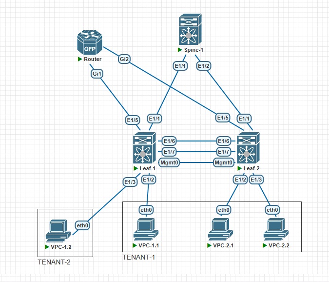

### VxLAN. Routing.

### Цель

- Реализовать передачу суммарных префиксов через EVPN route-type 5

## Задачи

- Разместить двух "клиентов" в разных VRF в рамках одной фабрики
- Настроить маршрутизацию между клиентами через внешнее устройство
- Задокументировать работы


### 1. Предварительные условия

** Схема стенда:** 



** В качестве коммутаторов - Nexus 9000v. В качестве роутера - CSR-1000v. На устройствах произведена настройка адресации согласно плана:**  

|Device|Interface|IP Address|Description|
|---|---|---|---|
Spine1|Lo0|11.11.11.11/32|
-|Eth1|10.2.1.0/31|Link to Leaf1|
-|Eth2|10.2.1.2/31|Link to Leaf2|
Leaf1|Lo0|1.1.1.1/32|
-|Eth1/1|10.2.1.1/31|Link to Spine1|
-|Eth1/2|VLAN 10|Link to VPC1.1|
-|Eth1/3|VLAN 30|Link to VPC1.2|
Leaf2|Lo0|2.2.2.2/32|
-|Eth1/1|10.2.1.3/31|Link to Spine1|
-|Eth1/2|VLAN 10|Link to VPC2.1|
-|Eth1/3|VLAN 30|Link to VPC2.2|
VPC1.1|Eth0|192.168.10.10/24|TENANT-1|
VPC1.2|Eth0|192.168.30.10/24|TENANT-2|
VPC2.1|Eth0|192.168.10.20/24|TENANT-1|
VPC2.2|Eth0|192.168.20.20/24|TENANT-1|

### 2.1 Настройка тенантов на Leaf

** Настройка на базе лабораторной №6. На лифах заводим vlan и vrf под два тенанта: ** 

```

vlan 1,10,20,30,100,200,500,600
vlan 10
  vn-segment 10010
vlan 20
  vn-segment 10020
vlan 30
  vn-segment 10030
vlan 100
  vn-segment 10100
vlan 200
  vn-segment 10200

vrf context TENANT-1
  vni 10100
  rd auto
  address-family ipv4 unicast
    route-target both auto
    route-target both auto evpn
vrf context TENANT-2
  vni 10200
  rd auto
  address-family ipv4 unicast
    route-target both auto
    route-target both auto evpn

interface Vlan10
  no shutdown
  vrf member TENANT-1
  no ip redirects
  ip address 192.168.10.1/24
  no ipv6 redirects
  fabric forwarding mode anycast-gateway

interface Vlan20
  no shutdown
  vrf member TENANT-1
  no ip redirects
  ip address 192.168.20.1/24
  no ipv6 redirects
  fabric forwarding mode anycast-gateway

interface Vlan30
  no shutdown
  vrf member TENANT-2
  no ip redirects
  ip address 192.168.30.1/24
  no ipv6 redirects
  fabric forwarding mode anycast-gateway

interface Vlan100
  no shutdown
  vrf member TENANT-1
  no ip redirects
  ip forward
  no ipv6 redirects

interface Vlan200
  no shutdown
  vrf member TENANT-2
  no ip redirects
  ip forward
  no ipv6 redirects

```

** Vlan 500,600 заводим под взаимодействие с роутером** 

```
interface Vlan500
  no shutdown
  vrf member TENANT-1
  no ip redirects
  ip address 10.50.50.2/29
  no ipv6 redirects

interface Vlan600
  no shutdown
  vrf member TENANT-2
  no ip redirects
  ip address 10.60.60.2/29
  no ipv6 redirects
```

** Настройка VxLAN** 
```
interface nve1
  no shutdown
  host-reachability protocol bgp
  advertise virtual-rmac
  source-interface loopback0
  member vni 100 associate-vrf
  member vni 10010
    ingress-replication protocol bgp
  member vni 10020
    ingress-replication protocol bgp
  member vni 10030
    ingress-replication protocol bgp
  member vni 10100 associate-vrf
  member vni 10200 associate-vrf
```

** Настройка маршрутизации** 
```
router bgp 65000
  address-family l2vpn evpn
  neighbor 11.11.11.11
    remote-as 65000
    update-source loopback0
    address-family l2vpn evpn
      send-community
      send-community extended
  vrf TENANT-1
    address-family ipv4 unicast
      redistribute direct route-map PERMIT
      redistribute hmm route-map PERMIT
    neighbor 10.50.50.3
      remote-as 55000
      address-family ipv4 unicast
    neighbor 172.16.0.1
      remote-as 65001
      address-family ipv4 unicast
  vrf TENANT-2
    address-family ipv4 unicast
      redistribute direct route-map PERMIT
      redistribute hmm route-map PERMIT
    neighbor 10.60.60.3
      remote-as 55000
      address-family ipv4 unicast

```


### 2.2 Настройка VPC для отказоустойчивого взаимодействия с роутером

** Leaf** 

```
vpc domain 1
  peer-switch
  peer-keepalive destination 192.168.250.0
  peer-gateway
  layer3 peer-router
  ip arp synchronize

interface port-channel50
  switchport
  switchport mode trunk
  vpc 50

interface port-channel100
  switchport
  switchport mode trunk
  spanning-tree port type network
  vpc peer-link


interface Ethernet1/5
  switchport
  switchport mode trunk
  channel-group 50 mode active

interface Ethernet1/6
  switchport
  switchport mode trunk
  channel-group 100 mode active

interface Ethernet1/7
  switchport
  switchport mode trunk
  channel-group 100 mode active
```

### 2.3 Настройка роутера

** Настройка portchannel** 
```
interface Port-channel50
 no ip address
 no negotiation auto
 no mop enabled
 no mop sysid
!
interface Port-channel50.500
 encapsulation dot1Q 500
 ip address 10.50.50.3 255.255.255.248
!
interface Port-channel50.600
 encapsulation dot1Q 600
 ip address 10.60.60.3 255.255.255.248
 
 interface GigabitEthernet1
 no ip address
 negotiation auto
 no mop enabled
 no mop sysid
 channel-group 50 mode active
!
interface GigabitEthernet2
 no ip address
 negotiation auto
 no mop enabled
 no mop sysid
 channel-group 50 mode active

```
**  Настройка маршрутизации с агрегированием ** 
```
router bgp 55000
 bgp log-neighbor-changes
 aggregate-address 192.168.0.0 255.255.0.0
 redistribute connected
 neighbor 10.50.50.1 remote-as 65000
 neighbor 10.50.50.2 remote-as 65000
 neighbor 10.60.60.1 remote-as 65000
 neighbor 10.60.60.2 remote-as 65000
```


### 3. Проверка

**  Trace VPC между TENANT идет через роутер ** 
```
VPCS> show

NAME   IP/MASK              GATEWAY                             GATEWAY
VPCS1  192.168.30.10/24     192.168.30.1
       fe80::250:79ff:fe66:68eb/64

VPCS> trace 192.168.10.10
trace to 192.168.10.10, 8 hops max, press Ctrl+C to stop
 1   192.168.30.1   6.483 ms  6.557 ms  11.975 ms
 2   10.60.60.3   21.824 ms  18.675 ms  18.502 ms
 3   10.50.50.1   30.187 ms  28.858 ms  32.301 ms
 4   *192.168.10.10   52.322 ms (ICMP type:3, code:3, Destination port unreachable)

VPCS> trace 192.168.20.20
trace to 192.168.20.20, 8 hops max, press Ctrl+C to stop
 1   192.168.30.1   6.871 ms  7.653 ms  7.826 ms
 2   10.60.60.3   20.214 ms  20.527 ms  19.658 ms
 3   10.50.50.1   50.466 ms  33.861 ms  43.365 ms
 4   *192.168.20.20   62.701 ms (ICMP type:3, code:3, Destination port unreachable)

VPCS> trace 192.168.10.20
trace to 192.168.10.20, 8 hops max, press Ctrl+C to stop
 1   192.168.30.1   6.378 ms  6.165 ms  6.225 ms
 2   10.60.60.3   23.449 ms  21.250 ms  29.684 ms
 3   10.50.50.1   143.893 ms  26.589 ms  25.538 ms
 4   *192.168.10.20   31.661 ms (ICMP type:3, code:3, Destination port unreachable)

```

Таблица маршрутизации на Leaf1. В VRF присутствует суммированный маршрут до другого тенанта

```
IP Route Table for VRF "TENANT-1"
'*' denotes best ucast next-hop
'**' denotes best mcast next-hop
'[x/y]' denotes [preference/metric]
'%<string>' in via output denotes VRF <string>

8.8.8.8/32, ubest/mbest: 1/0
    *via 10.50.50.3, [20/0], 02:08:28, bgp-65000, external, tag 55000
10.50.50.0/29, ubest/mbest: 1/0, attached
    *via 10.50.50.2, Vlan500, [0/0], 20:02:09, direct
10.50.50.2/32, ubest/mbest: 1/0, attached
    *via 10.50.50.2, Vlan500, [0/0], 20:02:09, local
10.60.60.0/29, ubest/mbest: 1/0
    *via 10.50.50.3, [20/0], 02:08:28, bgp-65000, external, tag 55000
192.168.0.0/16, ubest/mbest: 1/0
    *via 10.50.50.3, [20/0], 02:08:28, bgp-65000, external, tag 55000
192.168.10.0/24, ubest/mbest: 1/0, attached
    *via 192.168.10.1, Vlan10, [0/0], 20:02:09, direct
192.168.10.1/32, ubest/mbest: 1/0, attached
    *via 192.168.10.1, Vlan10, [0/0], 20:02:09, local
192.168.10.10/32, ubest/mbest: 1/0, attached
    *via 192.168.10.10, Vlan10, [190/0], 01:04:30, hmm
192.168.10.20/32, ubest/mbest: 1/0, attached
    *via 192.168.10.20, Vlan10, [190/0], 00:43:00, hmm
192.168.20.0/24, ubest/mbest: 1/0, attached
    *via 192.168.20.1, Vlan20, [0/0], 20:02:09, direct
192.168.20.1/32, ubest/mbest: 1/0, attached
    *via 192.168.20.1, Vlan20, [0/0], 20:02:09, local
192.168.20.20/32, ubest/mbest: 1/0, attached
    *via 192.168.20.20, Vlan20, [190/0], 00:43:00, hmm

IP Route Table for VRF "TENANT-2"
'*' denotes best ucast next-hop
'**' denotes best mcast next-hop
'[x/y]' denotes [preference/metric]
'%<string>' in via output denotes VRF <string>

8.8.8.8/32, ubest/mbest: 1/0
    *via 10.60.60.3, [20/0], 03:25:18, bgp-65000, external, tag 55000
10.50.50.0/29, ubest/mbest: 1/0
    *via 10.60.60.3, [20/0], 03:25:18, bgp-65000, external, tag 55000
10.60.60.0/29, ubest/mbest: 1/0, attached
    *via 10.60.60.2, Vlan600, [0/0], 20:02:09, direct
10.60.60.2/32, ubest/mbest: 1/0, attached
    *via 10.60.60.2, Vlan600, [0/0], 20:02:09, local
192.168.0.0/16, ubest/mbest: 1/0
    *via 10.60.60.3, [20/0], 03:02:23, bgp-65000, external, tag 55000
192.168.30.0/24, ubest/mbest: 1/0, attached
    *via 192.168.30.1, Vlan30, [0/0], 20:02:09, direct
192.168.30.1/32, ubest/mbest: 1/0, attached
    *via 192.168.30.1, Vlan30, [0/0], 20:02:09, local
192.168.30.10/32, ubest/mbest: 1/0, attached
    *via 192.168.30.10, Vlan30, [190/0], 01:05:10, hmm

```


Т
