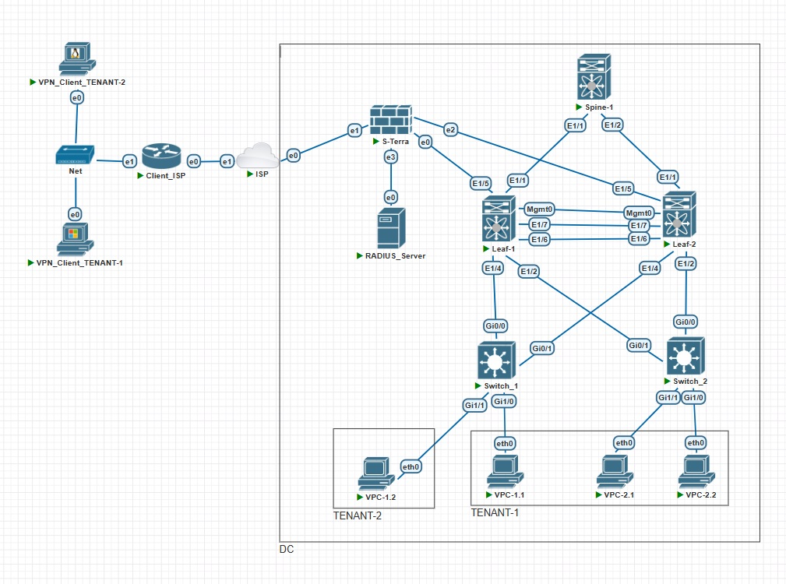
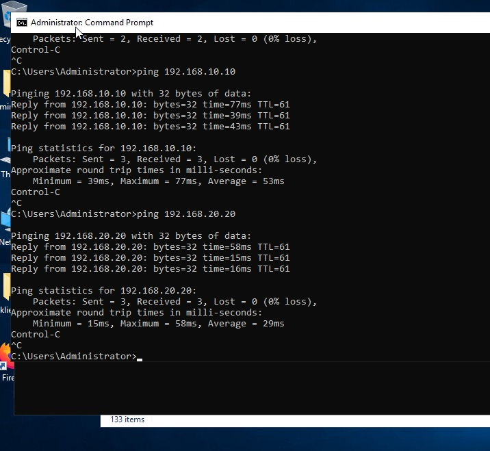
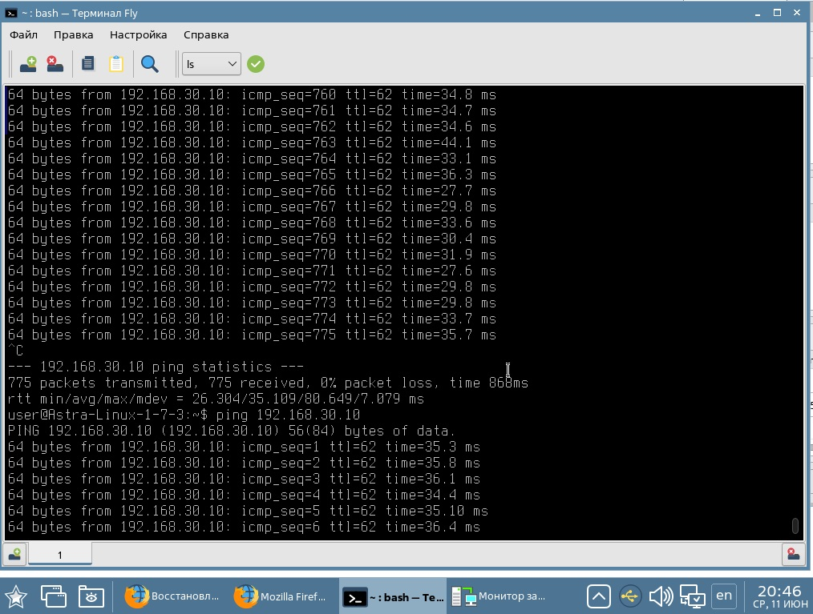

### Удаленный доступ к ресурсам ЦОД.

### Цель

- Реализовать удаленный доступ к ресурсам ЦОД

## Задачи

- Разместить "клиентов" в разных VRF в рамках одной фабрики
- Настроить маршрутизацию между клиентами через внешнее устройство
- Настроить удаленный доступ к разным VRF через шлюз безопасности S-Terra
- Задокументировать работы


### 1. Предварительные условия

__Схема стенда:__



__В качестве коммутаторов - Nexus 9000v. В качестве VPN-шлюза - С-Терра Шлюз v5.0. На устройствах произведена настройка адресации согласно плана:__

|Device|Interface|IP Address|Description|
|---|---|---|---|
Spine1|Lo0|11.11.11.11/32|
-|Eth1|10.2.1.0/31|Link to Leaf1|
-|Eth2|10.2.1.2/31|Link to Leaf2|
Leaf1|Lo0|1.1.1.1/32|
-|Eth1/1|10.2.1.1/31|Link to Spine1|
-|Eth1/2|Trunk|Link Switch1|
-|Eth1/4|Trunk|Link Switch2|
-|Eth1/5|PortChannel50|Link to S-Terra|
-|Eth1/6|PortChannel Peer-Link|Link to Leaf2|
-|Eth1/7|PortChannel Peer-Link|Link to Leaf2|
-|Mgmt0|PortChannel Peer-Link|Link to Leaf2|
Leaf2|Lo0|2.2.2.2/32|
-|Eth1/1|10.2.1.3/31|Link to Spine1|
-|Eth1/2|Trunk|Link Switch1|
-|Eth1/4|Trunk|Link Switch2|
-|Eth1/5|PortChannel50|Link to S-Terra|
-|Eth1/6|PortChannel Peer-Link|Link to Leaf2|
-|Eth1/7|PortChannel Peer-Link|Link to Leaf2|
-|Mgmt0|PortChannel Peer-Link|Link to Leaf2|
S-Terra|Lo0|33.33.33.33/32|
-|Eth1|172.17.100.2/24|Link to ISP|
-|Eth3|192.168.100.1/24|Link to RADIUS|
-|Eth0|Bond50.500|Link to Leaf1|
-|Eth2|Bond50.600|Link to Leaf2|
VPC1.1|Eth0|192.168.10.10/24|TENANT-1|
VPC1.2|Eth0|192.168.30.10/24|TENANT-2|
VPC2.1|Eth0|192.168.10.20/24|TENANT-2|
VPC2.2|Eth0|192.168.20.20/24|TENANT-1|

### 2.1 Настройка тенантов на Leaf

__Настройка на базе лабораторной №6. На лифах заводим vlan и vrf под два тенанта:__

```

vlan 1,10,20,30,100,200,500,600
vlan 10
  vn-segment 10010
vlan 20
  vn-segment 10020
vlan 30
  vn-segment 10030
vlan 100
  vn-segment 10100
vlan 200
  vn-segment 10200

vrf context TENANT-1
  vni 10100
  rd auto
  address-family ipv4 unicast
    route-target both auto
    route-target both auto evpn
vrf context TENANT-2
  vni 10200
  rd auto
  address-family ipv4 unicast
    route-target both auto
    route-target both auto evpn

interface Vlan10
  no shutdown
  vrf member TENANT-1
  no ip redirects
  ip address 192.168.10.1/24
  no ipv6 redirects
  fabric forwarding mode anycast-gateway

interface Vlan20
  no shutdown
  vrf member TENANT-1
  no ip redirects
  ip address 192.168.20.1/24
  no ipv6 redirects
  fabric forwarding mode anycast-gateway

interface Vlan30
  no shutdown
  vrf member TENANT-2
  no ip redirects
  ip address 192.168.30.1/24
  no ipv6 redirects
  fabric forwarding mode anycast-gateway

interface Vlan100
  no shutdown
  vrf member TENANT-1
  no ip redirects
  ip forward
  no ipv6 redirects

interface Vlan200
  no shutdown
  vrf member TENANT-2
  no ip redirects
  ip forward
  no ipv6 redirects

```

__Vlan 500,600 заводим под взаимодействие с S-Terra__

```
interface Vlan500
  no shutdown
  vrf member TENANT-1
  no ip redirects
  ip address 10.50.50.2/29
  no ipv6 redirects

interface Vlan600
  no shutdown
  vrf member TENANT-2
  no ip redirects
  ip address 10.60.60.2/29
  no ipv6 redirects
```

__Настройка VxLAN__
```
interface nve1
  no shutdown
  host-reachability protocol bgp
  advertise virtual-rmac
  source-interface loopback0
  member vni 100 associate-vrf
  member vni 10010
    ingress-replication protocol bgp
  member vni 10020
    ingress-replication protocol bgp
  member vni 10030
    ingress-replication protocol bgp
  member vni 10100 associate-vrf
  member vni 10200 associate-vrf
```

__Настройка маршрутизации__
```
router bgp 65000
  address-family l2vpn evpn
  neighbor 11.11.11.11
    remote-as 65000
    update-source loopback0
    address-family l2vpn evpn
      send-community
      send-community extended
  vrf TENANT-1
    address-family ipv4 unicast
      redistribute direct route-map PERMIT
      redistribute hmm route-map PERMIT
    neighbor 10.50.50.3
      remote-as 55000
      address-family ipv4 unicast
  vrf TENANT-2
    address-family ipv4 unicast
      redistribute direct route-map PERMIT
      redistribute hmm route-map PERMIT
    neighbor 10.60.60.3
      remote-as 55000
      address-family ipv4 unicast
```


### 2.2 Настройка VPC для отказоустойчивого взаимодействия с S-Terra

__Leaf__

```
vpc domain 1
  peer-switch
  peer-keepalive destination 192.168.250.0
  peer-gateway
  layer3 peer-router
  ip arp synchronize

interface port-channel50
  switchport
  switchport mode trunk
  vpc 50

interface port-channel100
  switchport
  switchport mode trunk
  spanning-tree port type network
  vpc peer-link


interface Ethernet1/5
  switchport
  switchport mode trunk
  channel-group 50 mode active

interface Ethernet1/6
  switchport
  switchport mode trunk
  channel-group 100 mode active

interface Ethernet1/7
  switchport
  switchport mode trunk
  channel-group 100 mode active
```

### 2.3 Настройка роутера

__Настройка portchannel__
```
!
interface Port-Channel50
!
interface Port-Channel50.500
 ip address 10.50.50.3 255.255.255.0
!
interface Port-Channel50.600
 ip address 10.60.60.3 255.255.255.0


root@S-Terra-Gate:~# cat /etc/network/interfaces.d/bond50
auto bond50
iface bond50 inet static
mtu 1500
slaves eth0 eth2
bond_mode 802.3ad
bond_miimon 100

root@S-Terra-Gate:~# cat /etc/network/interfaces.d/bond50.500
auto bond50.500
iface bond50.500 inet static
address 10.50.50.3
netmask 255.255.255.0
mtu 1500

root@S-Terra-Gate:~# cat /etc/network/interfaces.d/bond50.600

auto bond50.600
iface bond50.600 inet static
address 10.60.60.3
netmask 255.255.255.0
mtu 1500


```
__Настройка маршрутизации__
```
frr version 9.0.4
frr defaults traditional
hostname S-Terra-Gate
log syslog informational
no ipv6 forwarding
service integrated-vtysh-config
!
router bgp 55000
 bgp log-neighbor-changes
 no bgp ebgp-requires-policy
 coalesce-time 1000
 no bgp network import-check
 neighbor 10.50.50.1 remote-as 65000
 neighbor 10.50.50.2 remote-as 65000
 neighbor 10.60.60.1 remote-as 65000
 neighbor 10.60.60.2 remote-as 65000
 !
 address-family ipv4 unicast
  redistribute kernel
  redistribute connected
 exit-address-family
exit
!
end

```
__Настройка шифрования__

Для примера задано два профиля аутентификации - с радиус сервером и без.

```
crypto isakmp policy 1
 encr magma
 hash stribog-256
 authentication gost-sig
 group vko2
!
crypto isakmp policy 2
 encr gost
 hash gost341112-256-tc26
 authentication gost-sig
 group vko2
!
crypto isakmp profile CLIENTS_PROFILE
 match identity dn
 set identity mapping
 set policy 1
 set policy 2
 client authentication xauth otp
 client authentication banner "Enter your credentials."
 client authentication list RADIUS_LIST
 client username cert-subj-cn
!
crypto isakmp profile CLIENTS_PROFILE_NO_XAUTH
 match certificate CLIENTS_NO_XAUTH
 set identity mapping
 set policy 1
 set policy 2
 client authentication xauth
```

Доступ клиентов к разным тенантам описан в ACL

```
ip access-list extended TENANT-2_CLIENTS
 permit ip 192.168.10.0 0.0.0.255 192.168.255.0 0.0.0.255
 permit ip 192.168.20.0 0.0.0.255 192.168.255.0 0.0.0.255
!
ip access-list extended TENANT-1_CLIENTS
 permit ip 192.168.30.0 0.0.0.255 192.168.255.0 0.0.0.255
```

Для каждого тенанта задана криптокарта, описывающая шифруемый трафик, используемые алгоритмы,
профиль с привязкой к сертификату и методу аутентификации. При подключении ip клиента попадает
в таблицу маршрутизации и передается лифам по BGP.

```
crypto dynamic-map DMAP 2
 match address TENANT-1_CLIENTS
 set transform-set MAGMA_GOST_ENCRYPT_AND_INTEGRITY GOST_ENCRYPT_AND_INTEGRITY
 set isakmp-profile CLIENTS_PROFILE_NO_XAUTH
 set pool IKECFG_POOL_NO_XAUTH
 set security-association mss-fix out
 reverse-route
 set pre-fragmentation
 set dead-connection history off
crypto dynamic-map DMAP 3
 match address TENANT-2_CLIENTS
 set transform-set MAGMA_GOST_ENCRYPT_AND_INTEGRITY GOST_ENCRYPT_AND_INTEGRITY
 set isakmp-profile CLIENTS_PROFILE
 set security-association mss-fix out
 reverse-route
 set pre-fragmentation
 set dead-connection history off
!
crypto map VPN 1 ipsec-isakmp dynamic DMAP
!
!
interface GigabitEthernet0/1
 ip address 172.16.100.2 255.255.255.0
 ip access-group FW_INPUT_WAN in
 crypto map VPN
```

Полная конфигурация в приложенном файле S-Terra.txt. Настройка VPN-клиентов согласно вендорской документации https://doc.s-terra.ru/rh_output/5.0/Scenarios/output/index.htm#t=mergedProjects%2Fver_5_0_scn_1_06_client_xauth%2Fver_5_0_scn_1_06_client_xauth.htm.


### 3. Проверка

__Trace VPC1.2 между TENANT идет через С-Терру__
```
VPCS> show

NAME   IP/MASK              GATEWAY                             GATEWAY
VPCS1  192.168.10.20/24     192.168.10.1
       fe80::250:79ff:fe66:68e6/64

VPCS> trace 192.168.30.10
trace to 192.168.30.10, 8 hops max, press Ctrl+C to stop
 1   192.168.10.1   6.870 ms  6.323 ms  6.673 ms
 2   10.50.50.3   13.667 ms  12.230 ms  15.762 ms
 3   10.60.60.1   19.326 ms  23.132 ms  22.254 ms
 4   *192.168.30.10   43.365 ms (ICMP type:3, code:3, Destination port unreachable)


__Таблица маршрутизации на шлюзе содержит маршруты лифов и маршрут до ip клиента__

```

root@S-Terra-Gate:~# ip route
default via 172.16.100.1 dev eth1 proto st_policy
10.10.10.0/24 dev st_vti0 proto kernel scope link src 10.10.10.1
10.10.11.0/24 dev st_vti1 proto kernel scope link src 10.10.11.1
10.50.50.0/24 dev bond50.500 proto kernel scope link src 10.50.50.3
10.60.60.0/24 dev bond50.600 proto kernel scope link src 10.60.60.3
172.16.100.0/24 dev eth1 proto kernel scope link src 172.16.100.2
192.168.10.0/24 nhid 51 proto bgp metric 20
        nexthop via 10.50.50.1 dev bond50.500 weight 1
        nexthop via 10.50.50.2 dev bond50.500 weight 1
192.168.10.10 nhid 51 proto bgp metric 20
        nexthop via 10.50.50.1 dev bond50.500 weight 1
        nexthop via 10.50.50.2 dev bond50.500 weight 1
192.168.10.20 nhid 51 proto bgp metric 20
        nexthop via 10.50.50.1 dev bond50.500 weight 1
        nexthop via 10.50.50.2 dev bond50.500 weight 1
192.168.20.0/24 nhid 51 proto bgp metric 20
        nexthop via 10.50.50.1 dev bond50.500 weight 1
        nexthop via 10.50.50.2 dev bond50.500 weight 1
192.168.20.20 nhid 51 proto bgp metric 20
        nexthop via 10.50.50.1 dev bond50.500 weight 1
        nexthop via 10.50.50.2 dev bond50.500 weight 1
192.168.30.0/24 nhid 47 proto bgp metric 20
        nexthop via 10.60.60.1 dev bond50.600 weight 1
        nexthop via 10.60.60.2 dev bond50.600 weight 1
192.168.30.10 nhid 47 proto bgp metric 20
        nexthop via 10.60.60.1 dev bond50.600 weight 1
        nexthop via 10.60.60.2 dev bond50.600 weight 1
192.168.100.0/24 dev eth3 proto kernel scope link src 192.168.100.1
192.168.200.0/24 dev bond50 proto kernel scope link src 192.168.200.1
192.168.254.2 via 172.16.100.1 dev eth1 proto st_rri
192.168.255.100 via 172.16.100.1 dev eth1 proto st_rri


```

__Ping с клиента TENANT-1__



__Ping с клиента TENANT-2__



